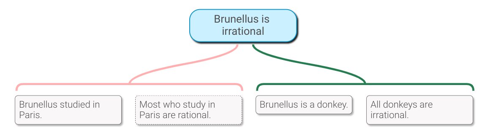

# Argument Maps in YAML

|[](https://atlas.mindmup.com/2022/07/aae05340f9f311eca4149f3188cae501/example_mup/index.html "Argument Map Example 1")|
|----------------------------|

<details open>
<summary>
<em>Collapsible Section: <strong>Table of Contents</strong></em>
</summary>
<br />
<!-- TOC -->

- [Argument Maps in YAML](#argument-maps-in-yaml)
  - [Installation](#installation)
    - [Dependencies](#dependencies)
  - [Getting Started](#getting-started)
  - [How to represent Argument Maps in YAML](#how-to-represent-argument-maps-in-yaml)
    - [Markdown Formatting](#markdown-formatting)
    - [Unique Identifiers](#unique-identifiers)
    - [Empty Lists](#empty-lists)
    - [Keys and Quotation](#keys-and-quotation)
    - [Notes, Labels, and Strength](#notes-labels-and-strength)
  - [argmap2mup.lua](#argmap2muplua)
  - [mup2argmap.lua](#mup2argmaplua)
  - [argmap2tikz.lua](#argmap2tikzlua)
  - [pandoc-argmap.lua](#pandoc-argmaplua)
    - [Default Google Folder](#default-google-folder)
    - [Embedding Maps in Markdown](#embedding-maps-in-markdown)
    - [Converting Maps Embedded in Markdown](#converting-maps-embedded-in-markdown)
    - [HTML5 Output](#html5-output)
    - [Displaying Argmaps with mapjs](#displaying-argmaps-with-mapjs)
    - [Uploading Maps to Google Drive](#uploading-maps-to-google-drive)
    - [Generating PDFs](#generating-pdfs)
    - [LaTeX and PDF output](#latex-and-pdf-output)
    - [Output in All Other Formats](#output-in-all-other-formats)
  - [Generating Interactive Argument Maps mapjs](#generating-interactive-argument-maps-mapjs)
    - [Installing mapjs](#installing-mapjs)
    - [Creating html pages containing mapjs with Pandoc](#creating-html-pages-containing-mapjs-with-pandoc)
    - [Using mapjs in your own projects](#using-mapjs-in-your-own-projects)
  - [Troubleshooting](#troubleshooting)
  - [License](#license)
  - [Contributing](#contributing)
  - [Relationships to Other Projects](#relationships-to-other-projects)

<!-- /TOC -->
--------------------------------
</details>

This repository contains some tools for working with argument maps written in a relatively simple [`YAML`](https://yaml.org/) format, described below. For example, the map above was generated from this `YAML`:

``` yaml
"Brunellus is irrational":
  r1:
    "Brunellus is a donkey.":
    "All donkeys are irrational.": 
  o1:
    "Brunellus studied in Paris.":
    "-Most who study in Paris are rational.":
```

The map above is also a hyper-link: click on it to open a read-only version of the map in [MindMup's Argument Visualization Mode](https://www.mindmup.com/tutorials/argument-visualization.html).

One of the tools is a filter for [Pandoc](https://pandoc.org/), a universal document converter. This will allow you to convert markdown files with embedded argument map code blocks into pdf or html containing a graphical or even interactive representation of the argument map.

<details open>
<summary>
<em>Collapsible Section: <strong>Installation</strong></em>
</summary>

## Installation

See [CHANGELOG.md](docs/CHANGELOG.md) for change notes.

This has been tested on Debian only. I believe the Lua code should be portable, but I'm not familiar enough with Lua to know for sure. Some of the supporting code e.g. contents of `/scripts` may work on other Linux distros or even MacOS, but will not work on Windows.

1. You can place `argmap2mup.lua`, `argmap2tikz.lua`, and `mup2argmap.lua` somewhere in your PATH e.g. ~/bin.

    Or you leave them in place and put symbolic links to them into your PATH, as has been done in `scripts/install.sh`. This script also removes the .lua extension from the links to reduce command line typing, however the examples below keep the .lua extension for clarity.

2. Place `pandoc-argmap.lua` in the `filters` folder inside your pandoc data directory, e.g. `$HOME/.local/share/pandoc/filters/pandoc-argmap.lua`.

3. For additional functionality, see **Dependencies** section.

### Dependencies

Tested with:

- Lua 5.3.4
- LuaRocks 3.7.0
- Pandoc 2.9.2.1-0; 2.6

`argmap2mup.lua`, `argmap2tikz.lua`, and `mup2argmap.lua` require:

- [penlight](https://github.com/stevedonovan/Penlight) (for command line option parsing)
- [lyaml](https://github.com/gvvaughan/lyaml) (for parsing `YAML`)
- [json](https://github.com/rxi/json.lua) (for encoding `JSON`)
- [LuaLogging: A simple API to use logging features in Lua](https://neopallium.github.io/lualogging/manual.html#introduction).

1. To install these dependencies, you can use the included rockspec file. Navigate to the package directory and run `luarocks make --only-deps argmap-[version number].rockspec` depending on latest version.

2. For lyaml, you may need to install [libyaml-dev](https://packages.debian.org/stretch/libyaml-dev) or [yaml (conda)](https://anaconda.org/anaconda/yaml).

3. `argmap2mup.lua` and `mup2argmap.lua` also depend on the command line utility [`gdrive`](https://github.com/prasmussen/gdrive) for Google Drive integration. Follow the link for installation instructions. (Note that on linux the 386 version is more likely to work: see <https://github.com/prasmussen/gdrive/issues/597>).

4. Converting the `tikz` code generated by `argmap2tikz.lua` to PDF requires several `TeX` packages, some of which you may need to install if they are not already available on your system. e.g. `texlive-latex-extra` and `texlive-luatex` from apt-get.

5. `pandoc-argmap.lua` depends on [Pandoc](https://pandoc.org/installing.html)(tested with v2.9.2.1 and v2.6), and on `argmap2lua` and `argmap2tikz.lua`. It also depends on [`pdf2svg`](http://www.cityinthesky.co.uk/opensource/pdf2svg/) for conversion to svg, and [ImageMagick](https://www.imagemagick.org/)'s `convert` for conversion to png.

6. To display MindMup JSON files on a web page as an interactive mindmap, without using the [MindMup website](https://www.mindmup.com/), see [Installing mapjs](#installing-mapjs).

See `environment.yml` for conda environment export of non-lua dependencies and version numbers.

--------------------------------
</details>

## Getting Started

1 ) As of argmap v4.8.13, all the `.mup` files generated by `argmap2mup.lua` should be viewable in MindMup. Easiest way to do this is with the upload to GDrive option, combined with [MindMup 2.0 for Google Drive](https://drive.mindmup.com/). See [argmap2mup.lua](#argmap2muplua) section of this README for more details.

2 ) See [`scripts/bash_aliases_argmap.sh`](scripts/bash_aliases_argmap.sh) for bash commands for streamlining the process. Note that some use the MindMup mapjs repo for displaying the mup file, using their legacy open source code.

3 ) There are some example files in the [examples](examples) and [test/input](test/input) folders of the repository.

Here are some things to try:

`$ cat examples/example.yml | argmap2mup.lua > output/example.mup`: generate a MindMup map from example.yml. Import that map into MindMup to work with.

`$ argmap2mup.lua -u examples/example-2.yml`: generate a MindMup map and upload it to your Google Drive. You can then go to Google Drive and open the map in MindMup to work with it.

[Create an argument map on MindMup](https://www.mindmup.com/tutorials/argument-visualization.html) and download it as a MindMup file (File → Download As → MindMup). Now convert it to `YAML`:

``` shell
mup2argmap.lua download.mup > download.yml
```

4 ) Next, try generating a PDF image from `example.yml`:

``` shell
cat examples/example.yml | argmap2tikz.lua -s > output/example.tex
lualatex output/example
```

5 ) Finally, try generating an HTML document from a markdown document containing an embedded argument map:

``` shell
pandoc examples/example.md -o output/example.html --lua-filter pandoc-argmap.lua
```

## How to represent Argument Maps in YAML

The goal here is to describe a spec for argument maps that is relatively easy for humans to read and write. The spec we use is much less ambitious than other specs that I know of, like [Argdown](https://argdown.org/) and the [Argument Interchange Format](http://www.argumentinterchange.org/).

For our purposes, an argument map consists of *claims* and *reasons*: each claim can be supported by zero or more reasons; each reason consists of zero or more claims.

We represent each *claim* as a key-value pair:

- the key is the content of the claim;
- the value is a (possibly empty) list of reasons.

So here is how we represent the claim that Brunellus is irrational unsupported by any reasons:

``` yaml
"Brunellus is irrational": {}
```

We also represent each *reason* as a key-value pair:

- the key is an identifier;
- the value is a (possibly empty) list of claims.

For example, here is a reason that consists of two claims:

``` yaml
  reason1:
    "Brunellus is a donkey.": {}
    "All donkeys are irrational.": {} 
```

There are two kinds of reasons: *supporting reasons* and reasons against (i.e., *objections*). We use the identifier to represent this difference:

- a reason whose key begins with an `o` or `-` is an objection;
- all other reasons are supporting reasons.

So that takes us back to our original example:

``` yaml
"Brunellus is irrational":
  r1:
    "Brunellus is a donkey.": {}
    "All donkeys are irrational.": {}
  o1:
    "Brunellus studied in Paris.": {}
    "-Most who study in Paris are rational.": {}
```

Note the '`-`' before "Most who study..". Claims are either *explicit* or *implicit*. We use the key to represent this:

- a claim whose key begins with a `-` is implicit;
- all other claims are explicit.

We also include a way to attach a single note to each claim, and a way to label reasons and specify their relative strength.

<details open>
<summary>
<em>Collapsible Section: <strong>Argmap Syntax Rules</strong></em>
</summary>

### Markdown Formatting

Each claim key is processed by Pandoc. This means that you should be able to get away with using simple markdown inside the claim keys.

``` yaml
"Brunellus is *probably* 90% H~2~O":
```

Keep in mind that MindMup offers very limited support for formatted text. So, for MindMup maps, formatting will be converted to Pandoc's "plain" output:

``` plain-text
Brunellus is _probably_ 90% H₂O
```

For `TikZ` maps, formatting will be converted to latex:

``` latex
Brunellus is \emph{probably} 90\% H\textsubscript{2}O
```

### Unique Identifiers

Note that the reasons for a given claim cannot share the same identifier.

Something like this will lead to unpredictable behaviour:

``` yaml
"Brunellus is irrational":
  reason: {}
  reason: {}
```

The resulting map will only display a single reason, and which one it will choose in unpredictable.

Instead, you need to ensure that the keys are distinct:

``` yaml
"Brunellus is irrational.":
  reason1: {}
  reason2: {}
```

Reasons for distinct claims can have the same identifier. So this is okay:

``` yaml
"Brunellus is a donkey.": 
  reason1: {}
"All donkeys are irrational.":
  reason1: {}
```

The same holds for claims: each of the claims that make up a given reason must have distinct keys. So don't write something like this:

``` yaml
"Brunellus is irrational":
  r1:
    "Brunellus is a donkey.": {}
    "Brunellus is a donkey.": {}
```

Since the key is the content of the claim, this restriction makes sense: you would not want to represent the same premise twice as part of a single reason. But, of course, the same premise can occur as part of two distinct reasons:

``` yaml
"Brunellus is irrational":
  r1:
    "Brunellus is a donkey.": {}
    "All donkeys are irrational.": {}
  r2:
    "Brunellus is a donkey.": {}
    "Most donkeys I've met have been irrational.": {}
```

### Empty Lists

Note that every claim is represented as key-value pair, where the value is a list of reasons. If there are no reasons offered for or against a claim, that means that the value is an empty list. You can represent this empty list explicitly if you like:

``` yaml
    "Brunellus is a donkey.": {}
```

Or you can leave it implicit, omitting the '`{}`'. But you still *must* put the colon ('`:`') after the claim:

``` yaml
    "Brunellus is a donkey.": 
```

In practice, the implicit empty list notation is preferred, because it means you don't have to delete the braces before adding reasons in support of a claim.

### Keys and Quotation

`YAML` allows just about any string to be a key, but you do have to be careful about quotes and line-wrapping. If your key has no special characters, like '`:`', you get away with omitting the quotes:

``` yaml
    Brunellus is a donkey.: 
```

Multiline keys are also possible, but the format is a bit complicated ([1](https://stackoverflow.com/questions/35091646/multiple-line-key-in-yaml), [2](https://stackoverflow.com/a/26556401))

``` yaml
?
 "Brunellus is a donkey who wanted a longer tail, and he went to Paris
 to study, but he couldn't remember the city's name."
:
  r1:
    ?
     "The wikipedia says that Brunellus is a donkey who wanted a longer
     tail, and he went to Paris to study, but he couldn't remember the
     city's name."
    :
    ?
     "The wikipedia is a reliable source for information about donkeys
     in medieval literature."
    :
```

### Notes, Labels, and Strength

(Currently, notes are only supported for MindMup input and output, and do not appear in TikZ output.)

You can attach one *note* to any claim (if you attach more than one note, only one of them will be processed). A note is represented by a key-value pair, where the key is the string "note" and the value is the content of the note. To attach a note to a claim, add it to the list of reasons:

``` yaml
Brunellus is irrational:
  r1:
    Brunellus is a donkey.: 
      note: |
        Brunellus means "brown one" in Latin, and was the name of a stock character in medieval logic texts.
    All donkeys are irrational.: 
  note: |
    Although donkeys *are* notoriously stubborn, it seems a bit much to suppose that irrationality is the defining feature of a donkey.
```

Notes are also processed by Pandoc, allowing the use of simple markdown.

You can attach a *label* or *strength* to any reason. A label is a key-value pair, where the key is the string "label" and the value is the content of the label. A strength is a key-value pair, where the key is "strength" and the value is a number between 1 (weak) and 5 (strong). Labels and strengths are added to the list of a reason's claims:

``` yaml
Brunellus is irrational:
  r1:
    Brunellus is a donkey.: 
    All donkeys are irrational.:
    label: argumentum ad asinum
    strength: 4
  o1:                                            
    Brunellus studied in Paris.: 
    -Most who study in Paris are rational.:
    label: argumentum ad parisiensis
    strength: 2
```

--------------------------------
</details>
<br />

## `argmap2mup.lua`

As of argmap v4.8.13, all the `.mup` files generated by `argmap2mup.lua` should be viewable in MindMup. Easiest way to do this is with the `--upload` to GDrive option, combined with [MindMup 2.0 for Google Drive](https://drive.mindmup.com/).

`argmap2mup.lua` is a pipe for converting `YAML` maps to `JSON` encoded MindMup maps.

It takes as its input the first CLI argument that is not an option, or, if there is no such argument, STDIN.

``` shell
$ cat examples/example.yml | argmap2mup.lua | jq
{
  ⋮
  "ideas": {
    "1": {
      "attr": {},
      "title": "Brunellus is irrational",
      ⋮
}
```

(Here I've used [`jq`](https://stedolan.github.io/jq/) to pretty-print the `JSON` output.)

The following options are available:

`-u, --upload`: Upload to Google Drive.

If this option is selected, then, instead of dumping the map to STDOUT, it is uploaded to Google Drive, and its Google Drive ID is returned.

``` shell
$  argmap2mup.lua -u examples/example.yml
1e4HAl1iHPKBiKZ_BI_yBw7rXYbuvMsC2
```

If you have connected your MindMup account to Google Drive, you can use this Google Drive ID to construct a URL that allows you to open the file directly in MindMup. The format for the URL is: `https://drive.mindmup.com/map/ID`

`-g ID, --gdrive_id ID`: Update the file with ID on Google Drive.

By default, `argmap2mup.lua` creates a new file on your Google Drive every time you run it. If you have already uploaded a map, and would prefer to update that map rather than create a new one, use this option to specify its Google Drive ID. If you don't know its Google Drive ID, use `gdrive list` to find it. This command implies `--upload`:

``` shell
cat examples/example.yml | argmap2mup.lua -g 1e4HAl1iHPKBiKZ_BI_yBw7rXYbuvMsC2
```

`-f ID, --folder ID`:  upload to Google Drive folder with ID

For example, I prefer to upload all of my automatically generated maps to a folder called `argmaps`.

`p, --public`: Mark the uploaded file as shareable.

By default, files uploaded to Google Drive are private and unshared. Use this flag to mark them as shareable instead. This option also implies `--upload`.

`-n, --name`: Specify a name for your map.

This name is used to set the title attribute within the map itself. It is also used as the name of the file on Google Drive. If this option is omitted, and so no name is specified, the conclusion of the argument will be used as the name. No sanity checks are performed on this: no doubt you can break things by specifying weird things as the name.

`-h, --help`: Display a brief synopsis of these options.

For more information about the structure of the .mup/.json output format, see: [Data Format · MindMup/mapjs Wiki](https://github.com/mindmup/mapjs/wiki/Data-Format).

## `mup2argmap.lua`

`mup2argmap.lua` is a pipe for converting MindMup maps into the argmap `YAML` format.

It takes as its input the first CLI argument that is not an option, or, if there is no such argument, STDIN.

``` shell
cat examples/example.mup | mup2argmap.lua
mup2argmap.lua examples/example.mup
```

The following options are available:

`-g ID, --gdrive_id ID`: read the file with the specified Google Drive ID.

This option takes precedence any files specified on the command line or anything piped to STDIN.

`-e, --embed`: wrap output in a Pandoc markdown code block with attributes,
suitable for embedding.

`-h, --help`: Display a brief synopsis of these options.

## `argmap2tikz.lua`

`argmap2tikz.lua` is a pipe for converting `YAML` maps to TikZ pictures, suitable for embedding in `LaTeX`. It takes as its input the first CLI argument that is not an option, or, if there is no such argument, STDIN.

``` latex
$ cat examples/example.yml | argmap2tikz.lua

\begin{tikzpicture}
  ⋮ 
  {
    c1/"Brunellus is irrational
"[claim]
      --[opposingedge]
      r2/"" [opposing] // [ tree layout ] {
      ⋮
\end{tikzpicture}      
```

Note that it uses TikZ's `graph` support, and TikZ's `graph` support only works with `lualatex`. So you need to use `lualatex` instead of `pdflatex` or `xelatex` to convert the `tikz` code to PDF.

Also note that the resulting `tikz` code requires some settings in your preamble. For the required settings, see the `--includes` option below.

The following options are available:

`-s, --standalone`: generate a standalone LaTeX file.

``` latex
$ argmap2tikz.lua -s examples/example.yml

\documentclass[tikz]{standalone}
    \usepackage{tikz}
    \usetikzlibrary{graphs,graphdrawing}
    ⋮
\begin{document}
\begin{tikzpicture}
    ⋮
\end{tikzpicture}
\end{document}
```

This standalone LaTeX file is suitable for generating a PDF image of the map, which can then be used as is or converted into other formats using other tools.

e.g.

``` shell
argmap2tikz.lua -s examples/example.yml > output/example.tex
lualatex output/example
convert output/example.pdf output/example.png
```

`-i, --includes`: dump lines suitable for including in a `LaTeX` preamble

`-t, --template`: dump lines suitable for including in a `LaTeX` preamble in a
Pandoc template.

If you want to use the `tikz` code inside your own `LaTeX` file, include the
output of `--includes` in your preamble:

``` latex
$ argmap2tikz.lua -i

    \usepackage{tikz}
    \usetikzlibrary{graphs,graphdrawing}
    ⋮
    \usepackage{varwidth}
    \newcommand{\argmapmaxnodewidth}{15em}
```

If you want to use the `tikz` code with Pandoc, include the output of `--template` in a [custom Pandoc `LaTeX` template](https://pandoc.org/MANUAL.html#templates), and set the metadata variable `argmaps` to `true`, either in your document's `YAML` metadata block, or using the `--metadata` option.

``` latex
$ argmap2tikz.lua -t

$if(argmaps)$
    \usepackage{tikz}
    \usetikzlibrary{graphs,graphdrawing}
    ⋮
    \usepackage{varwidth}
    \newcommand{\argmapmaxnodewidth}{15em}
$endif$
```

`-h, --help`: Display a brief synopsis of these options.

<details open>
<summary>
<em>Collapsible Section: <strong>pandoc-argmap.lua</strong></em>
</summary>

## `pandoc-argmap.lua`

`pandoc-argmap.lua` is a [Pandoc Lua filter](https://pandoc.org/lua-filters.html) for converting `YAML` argument maps embedded in a Pandoc document, using `argmap2mup.lua` and `argmap2tikz.lua`.

If you're not familiar with Pandoc, see the official: [Pandoc - Getting started with pandoc](https://pandoc.org/getting-started.html).

### Default Google Folder

I put a line like this at the top of my personal copy of `pandoc-argmap.lua`:

``` lua
local gdriveFolder = "11w-foIj3p_FWSUROEX0VJg1KsslhJR0m"
```

This tells Pandoc to upload all the maps it generates to a specific folder on my Google Drive.

### Embedding Maps in Markdown

Embedded argument maps are represented as code blocks with the class `argmap`.

``` yaml
    ``` {.argmap}
    "Brunellus is irrational":
      r1:
        "Brunellus is a donkey.":
        "All donkeys are irrational.":
      o1:
        "Brunellus studied in Paris.":
        "-Most who study in Paris are rational.":
    ```
```

As per [Pandoc's markdown format for Fenced code blocks](https://pandoc.org/MANUAL.html#extension-fenced_code_attributes), you can use:

- \# for an id
- . for classes
- attribute="value" for assigning values.

If you want your argmap to be converted into [mapjs format](#displaying-argmaps-with-mapjs), then add the attribute to="js". See section [Generating mapjs Interactive Argument Maps](#generating-interactive-argument-maps-mapjs) for more details.

A name and Google Drive ID can also be specified as attributes of the code block:

``` yaml
    ``` {.argmap name="A Donkey Argument" gid="1X6uD8KyrSawW2qSqhmPaNtuSy-6eEK6g"}
    "Brunellus is irrational":
      r1:
        "Brunellus is a donkey.":
        "All donkeys are irrational.": 
      o1:
        "Brunellus studied in Paris.":
        "-Most who study in Paris are rational.":
    ```
```

### Converting Maps Embedded in Markdown

To convert a markdown document containing argument maps, use the `--lua-filter` option with Pandoc:

``` shell
pandoc examples/example.md -o test/output/example.html --lua-filter pandoc-argmap.lua
```

By default, this will generate a `png` image representing the argmap.

Alternatively, the next two sections describe how to generate an `svg` image or a `mapjs` interactive map.

### HTML5 Output

If the output format is html5, and you are not using the mapjs output format, then the filter generates individual pdf files for each map, and uses `pdf2svg` to convert them to svg, which are embedded directly into the html file.

### Displaying Argmaps with mapjs

You can display MindMup JSON files on a web page as an interactive mindmap without using the [MindMup website](https://www.mindmup.com/), by using a customised version of [mapjs](https://github.com/mindmup/mapjs-webpack-example).

Here is an example:

|[](test/input/example-updated.html "Argument Mapjs Example 1 - Brunellus")|
|-------------------------------|

mapjs is an earlier, open source version of MindMup, and while it does not look as attractive, it provides similar functionality.

See [Generating Interactive Argument Maps mapjs](#generating-interactive-argument-maps-mapjs) for details of how to use it.

### Uploading Maps to Google Drive

By default, `pandoc-argmap.lua` does the following:

1. Replaces each embedded `YAML` map with a TikZ generated image of the map;
2. Generates a MindMup map;
3. Uploads it to Google Drive, and links the image to the MindMup url.

It will not do this when displaying in argmapjs format.

Alternatively, if your output format is `markdown` and you add the code block attribute "tidy=true", the filter will skip step '1. Replacing the map with a TikZ image' above, and will just do steps 2 and 3.

e.g.

``` yaml
    ``` {.argmap tidy=true}
    "Brunellus is irrational":
    ```
```

In addition, if the Google Drive `gid` attribute for the file is added to the code block, it will associate the map in your markdown file with a specific map on your Google Drive. This will ensure that future conversions will update that map, rather than cluttering your Google Drive with a new map every time.

### Generating PDFs

If you want to generate a PDF file using `LaTeX`, you will also need to use the `--pdf-engine=lualatex` option, and use a custom template with the `--template`:

``` shell
pandoc examples/example.md -o output/examples/example.pdf --lua-filter pandoc-argmap.lua --pdf-engine lualatex --template examples example-template.latex
```

If you prefer, you could use the `--include-in-header` option instead of a custom template:

``` shell
argmap2tikz.lua -i > output/header.tex
pandoc examples/example.md -o output/example.pdf --lua-filter pandoc-argmap.lua --pdf-engine lualatex --include-in-header output/header.tex
```

### LaTeX and PDF output

If the output format is latex, the filter directly embeds the TikZ image code into the latex file as raw latex. So if you want to use Pandoc to directly produce a PDF using one of its latex engines, you will need to specify `--pdf-engine lualatex` and use a custom template or the `--include-in-header` option.

``` shell
pandoc examples/example.md -o output/example.pdf --lua-filter pandoc-argmap.lua --template custom.latex --pdf-engine lualatex
```

### Output in All Other Formats

For all other formats, it uploads the MindMup file to Google Drive and generates individual pdf files for each map, and then converts them to png using ImageMagick's `convert` command. It replaces the code block with a paragraph containing the generated image, linked to the MindMup file.

</details>

<details open>
<summary>
<em>Expandable Section: <strong>Generating Interactive Argument Maps (mapjs)</strong></em>
</summary>

## Generating Interactive Argument Maps (mapjs)

 |[](test/input/example-updated.html "Argument Mapjs Example 1")|
 |----------------|

This interactive mindmap format is an alternative way to display your argument maps in html pages.

### Installing mapjs

I have added a custom branch of repo [`s6mike/mapjs-webpack-example at custom`](https://github.com/s6mike/mapjs-webpack-example/tree/custom) to a sub-folder, `map-js`.

To set this up, you will need to:

1. Install `node.js` and then run `npm --prefix [path to mapjs folder] install` to grab the dependencies.

2. Call `npm run --prefix [path to mapjs folder] pack` to build the app with webpack.

This builds the client side JavaScript file which activates the maps: `mapjs/public/js/main.bundle.js`. This needs to be added to any page displaying the map in .json format.

See [mapjs/README.md](mapjs/README.md) for more details about mapjs.

### Creating html pages containing mapjs with Pandoc

You can convert an argmap inside a markdown file into html containing `mapjs` by doing the following:

1a ) Either adding attribute `to="js"` to the code block:

  ``` yaml

    ``` {.argmap name="An argument about a donkey" to="js"}
    "Brunellus is irrational":
      r1:
        "Brunellus is a donkey.":
        "All donkeys are irrational.":
      o1:
        "Brunellus studied in Paris.":
        "-Most who study in Paris are rational.":
    ```

  ```

b) Or you can set a default value `to:` value for all argmap blocks in the document by adding this to the document metadata:

``` yaml
argmap:
  to: js
```

e.g.

  ``` yaml
      ---
      title: An Example
      argmaps: true
      argmap:
        to: js
      ---

      This is an example of an argument about a donkey!

      ``` {.argmap name="An argument about a donkey"}
      "Brunellus is irrational":
        r1:
          "Brunellus is a donkey.":
          "All donkeys are irrational.":
        o1:
          "Brunellus studied in Paris.":
          "-Most who study in Paris are rational.":
      ```
  ```

2 ) The simplest way to convert your argmap code block into the mapjs format is to use the `pandoc-argmap.lua` filter and provided Pandoc template to convert the markdown document into html containing mapjs.

e.g.

``` shell
pandoc input/example-updated.md --template /pandoc-templates/mapjs/mapjs-main-html5.html --metadata=mapjs-output-js:/mapjs-example/public/main.js --metadata=css:mapjs-default-styles.css --lua-filter=/src/pandoc-argmap.lua > output.html
```

3 ) Open `output.html` in a browser to see the map.

If you can see the map controls but not the map, check the console for errors.

If you get a CORS origin error, you can fix it easily in Chrome by opening it with the command line option `--allow-file-access-from-files`. Other browser should have similar solutions.

Note that this disables a security feature, so best to use this option only when viewing mapjs files.

### Using mapjs in your own projects

You can adapt the above for your own DIY approach:

1 ) Create a JSON file using `src/argmap2mup`, and put it somewhere accessible from your web page.

2 ) Embed it into an html page using html like this, replacing `[JSON file path]` with the path:

``` html
<div id="container_argmap1" class="container_argmapjs">
  <script type="application/json" class="argmap_json" src="[JSON file path]"></script>
</div>
```

The container and script classes must be as above. The container div id can be as you wish.

3 ) Add the mapjs script built from webpack:
  `<script src="/mapjs-example/public/main.js"></script>`

4 ) Add the included stylesheet to ensure the mapjs is formatted properly:
  `<link rel="stylesheet" href="mapjs-default-styles.css" />`

I have written scripts to help with this workflow, you may be able to adapt them for your purposes. See `scripts/bash-aliases-argmap.sh`.

See [mapjs README.md](mapjs/README.md) for a customised version of the original (and brief) mapjs documentation.

For more information about the structure of the mapjs output format (`.json`/`.mup`), see: [Data Format · MindMup/mapjs Wiki](https://github.com/mindmup/mapjs/wiki/Data-Format).

See [Displaying Argmaps with mapjs](#displaying-argmaps-with-mapjs) for other ways to use mapjs with argmap.

</details>

--------------------------------

## Troubleshooting

1. Error `sh: 1: webpack: not found`: Install `node.js`, navigate to folder `mapjs` and run `npm install`.

## License

This project is licensed under the MIT License - see the [LICENSE](LICENSE) file for details.

## Contributing

I could use all the help I can get :)

So if you'd like to help make argument maps more effective, have a look at [CONTRIBUTING.md](CONTRIBUTING.md).

## Relationships to Other Projects

This repo inherits from:

1 ) <https://github.com/dsanson/argmap>: The source of most of the functionality and documentation.

Changes include: Issue fixes (potentially caused by different lua version) which ensures MindMup compatibility, and renamed files, added scripts, environment and config files for development convenience.

2 ) <https://github.com/mindmup/mapjs-webpack-example>: To display MindMup JSON files on a web page as an interactive mindmap, without using the [MindMup website](https://www.mindmup.com/). This is an earlier, open source version of MindMup, customised to display the output from argmap2mup by passing the filename to the webpack build as an environment variable. See [Using mapjs to display argmaps](#displaying-argmaps-with-mapjs) section for more details.

Changes include: moving the functionality to a sub-folder, and getting start.js to dynamically read JSON files from the web page its on, instead of building them into webpack.

--------------------------------

Uses [Semantic Versioning 2.0.0](https://semver.org/) and [Conventional Commits 1.0.0](https://www.conventionalcommits.org/en/v1.0.0/).

Though documentation is not yet precise and comprehensive! Lua code is well documented, but the bash scripts still need to be properly documented.

Note that test files, and bash script functions beginning with __ are not considered part of a public API, and therefore may change during patch updates without warning.

Copyright 2019 David Sanson; 2022 Michael Hayes; and the argmap contributors
SPDX-License-Identifier: MIT
