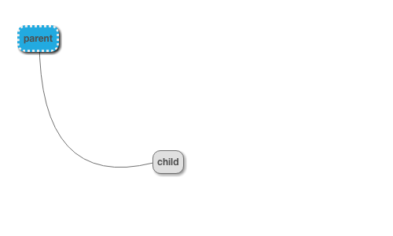
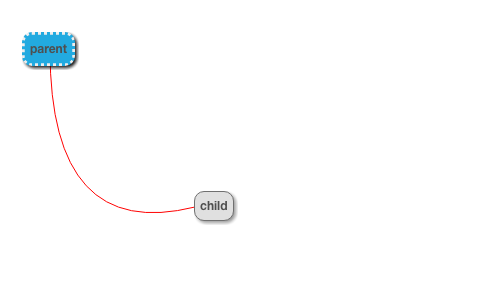
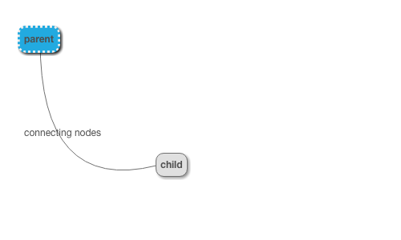

# Connector properties

These examples show the effect of the `parentConnector` attribute of a node

## basics

Without any properties, the connector uses the default theme style

~~~json example="basic connector"
{}
~~~

## setting the color 

~~~json example="color connector"
{"color": "#ff0000"}
~~~

## setting the line type

~~~json example="line type"
{"lineStyle": "dashed"}
~~~

## setting the label

~~~json example="line label"
{"label": "connecting nodes"}
~~~

