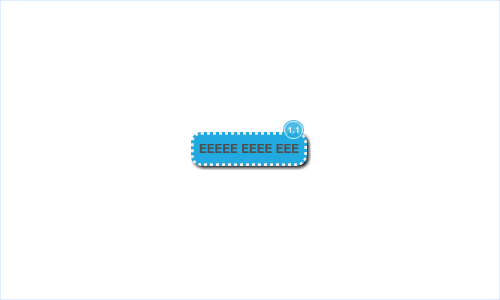
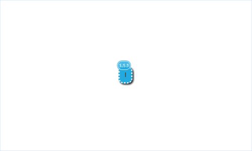
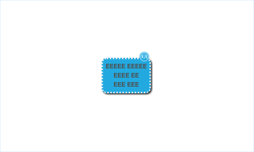

# Node Labels

Labels show in the right-top corner of a node:
~~~yaml example="node with label"
title: EEEEE EEEE EEE
label: "1.1"
~~~

Labels do not get clipped when they are wider than a node

~~~yaml example="node with short text and label"
title: I
label: "1.1.1"
~~~

Labels are not affected by the height of a node, they always show in the top-right corner

~~~yaml example="node with multiline text and label"
title: "EEEEE EEEEE\nEEEE EE\nEEE EEE"
label: "1.1"
~~~

