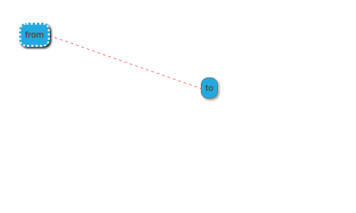
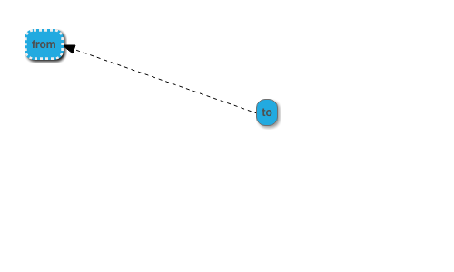
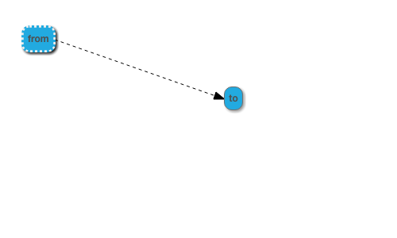
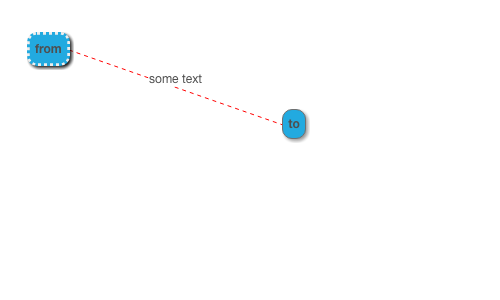
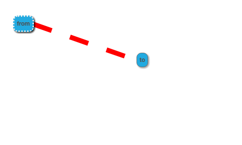
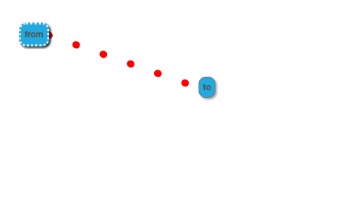
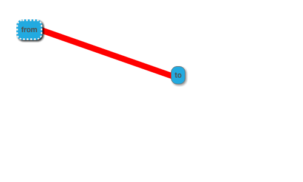
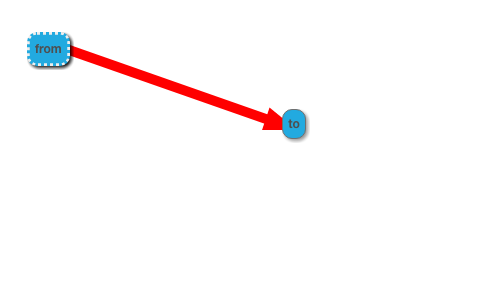
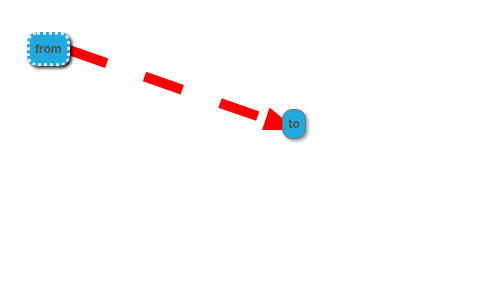

# Link properties

These examples show the effect of the link attributes of a node

## setting the color

~~~json example="color link"
{"color": "#ff5555"}
~~~

## setting the line type

~~~json example="dashed line type"
{
"color": "#000000",
"lineStyle": "dashed"
}
~~~

~~~json example="solid line type"
{
"lineStyle": "solid",
"color": "#000000"
}
~~~

## setting the arrow from

~~~json example="link arrow from"
{
"arrow": "from",
"color": "#000000"
}
~~~

## setting the arrow to

~~~json example="link arrow to"
{
"arrow": "to",
"color": "#000000"
}
~~~

## setting the arrow both ends

~~~json example="link arrow both"
{
"arrow": "both",
"color": "#000000"
}
~~~

## setting the arrow false

~~~json example="link arrow false"
{
"arrow": false,
"color": "#000000"
}
~~~

## setting the arrow true

~~~json example="link arrow"
{
"arrow": true,
"color": "#000000"
}
~~~

## combining multiple attributes

~~~json example="link combination"
{
"arrow": true,
"color": "black",
"lineStyle": "dashed"
}
~~~

## can paint label

~~~json example="with label"
{
"label": "some text"
}
~~~

## line caps

Solid lines should have square end caps

~~~json example="straight caps"
{
  "lineStyle": "solid",
  "width": 10
}
~~~

Dashed should not set any line end caps

~~~json example="dashed caps"
{
  "lineStyle": "dashed",
  "width": 10
}
~~~

Dotted should set rounded end caps

~~~json example="dotted caps"
{
  "lineStyle": "dotted",
  "width": 10
}
~~~

## setting line width

Line width controls thickness

~~~json example="line width"
{
"width": 10,
"lineStyle": "solid"
}
~~~

Arrow head should also become thicker if width is set

~~~json example="width and arrows"
{
"width": 10,
"lineStyle": "solid",
"arrow": true
}
~~~

Dash spacing should increase proportionally to width (4x)

~~~json example="width and dashes"
{
"arrow": true,
"width": 10,
"lineStyle": "dashed"
}
~~~

