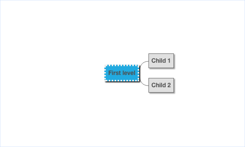
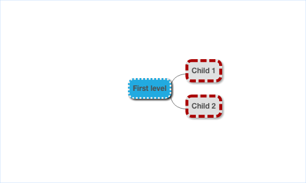

# Node Theming

By default, borders are solid and rounded, titles are centred with a small padding around the text:

~~~yaml example="basic node theme"
name: default
~~~

A theme can set the background color for a node
~~~yaml example="background-color"
name: default
backgroundColor: "#FFFFFF"
~~~

A theme can set the corner radius for a node

~~~yaml example="corner-radius"
name: default
cornerRadius: 0
~~~

A theme can set the properties for a particular level 

~~~yaml example="level"
name: level_2
backgroundColor: "#FFFFFF"
cornerRadius: 0
~~~

A theme can set border color, width and style

~~~yaml example="border"
name: default
border:
  type: surround
  line:
    color: "#AA0000"
    width: 5
    style: dashed
~~~

