# Node titles

By default, titles are centred with a small padding around the text:

~~~yaml example="basic node title"
title: hello
~~~

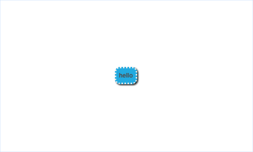

New lines cause line breaks:

~~~yaml example="node titles with line breaks"
title: "hello\nthere\n3 lines"
~~~

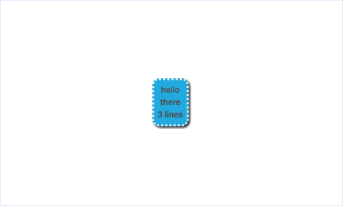

long text causes line wraps:

~~~yaml example="node title wrapping with default width"
title: "some long text is actually quite long and may get annoyingly long so it needs to wrap and wrap and automatically take up new lines"
~~~

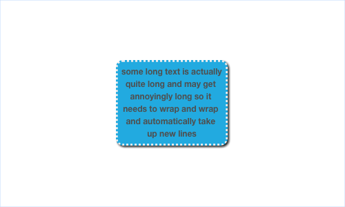

Theme text maxWidth sets the wrapping boundary:

~~~yaml example="node title wrapping with theme width"
title: "some long text is actually quite long and may get annoyingly long so it needs to wrap and wrap and automatically take up new lines"
textTheme:
  maxWidth: 300
~~~

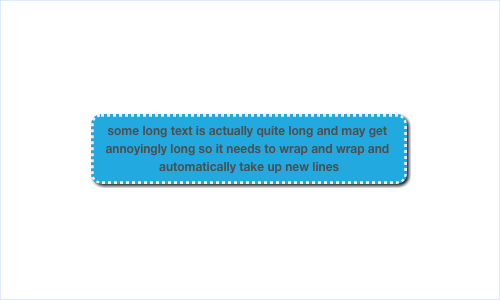

Theme text maxWidth does not expand the node if not needed:

~~~yaml example="short node title with theme width"
title: short
textTheme:
  maxWidth: 300
~~~

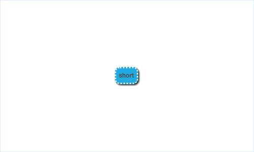

## Font multiplier stying

Font multiplier can control node text size

~~~json example="larger node title"
{
	"title": "hello",
	"style": {
		"fontMultiplier": 2.5
	}
}
~~~

Font multiplier can also decrease the font size

~~~json example="smaller node title"
{
	"title": "hello",
	"style": {
		"fontMultiplier": 0.5
	}
}
~~~

### Custom width

Specifying a width in the node style makes the node longer even if the text is narrower than the width

~~~yaml example="node title + width"
title: hello
style:
  width: 200
~~~

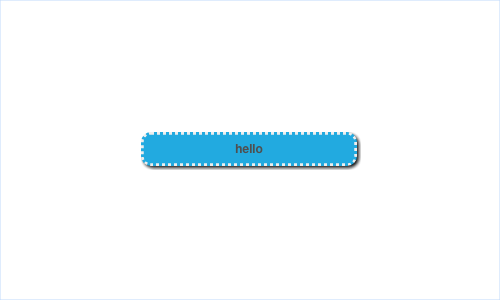

Long node titles wrap around the custom width

~~~yaml example="long node title + width"
title: hello hello hello hello hello hello hello hello hello hello hello hello hello hello hello hello
style:
  width: 200
~~~

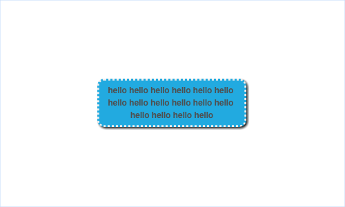

Line breaks also work around custom width

~~~yaml example="long node title with line break + width"
title: "hello\nhello hello hello hello hello hello hello hello hello hello hello hello hello hello\nhello"
style:
  width: 200
~~~

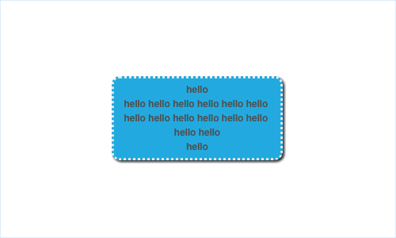

Custom width takes precedence over theme max width if it is shorter

~~~yaml example="custom width shorter than theme"
title: "some long text is actually quite long and may get annoyingly long so it needs to wrap and wrap and automatically take up new lines"
style:
  width: 200
textTheme:
  maxWidth: 350
~~~

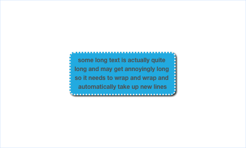

~~~yaml example="custom width longer than theme"
title: "some long text is actually quite long and may get annoyingly long so it needs to wrap and wrap and automatically take up new lines"
style:
  width: 450
textTheme:
  maxWidth: 350
~~~

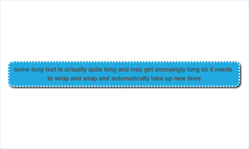

### Text Alignment

Left aligned text

~~~json example="left aligned text"
{
  "title": "hello\nthere\nlonger line here",
  "style": {
    "textAlign": "left"
  }
}
~~~

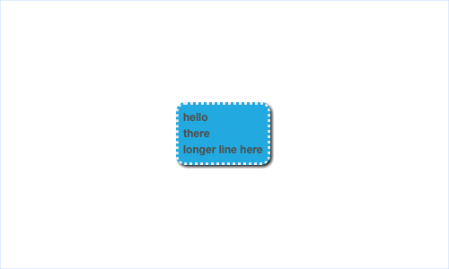

Start aligned text

~~~json example="start aligned text"
{
  "title": "hello\nthere\nlonger line here",
  "style": {
    "textAlign": "start"
  }
}
~~~

Right aligned text

~~~json example="right aligned text"
{
  "title": "hello\nthere\nlonger line here",
  "style": {
    "textAlign": "right"
  }
}
~~~

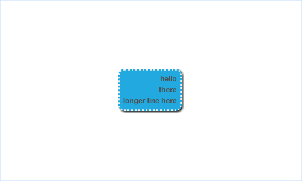

Center aligned text

~~~json example="center aligned text"
{
  "title": "hello\nthere\nlonger line here",
  "style": {
    "textAlign": "center"
  }
}
~~~

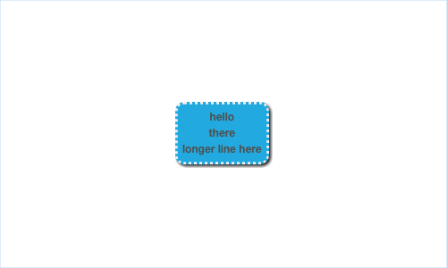

